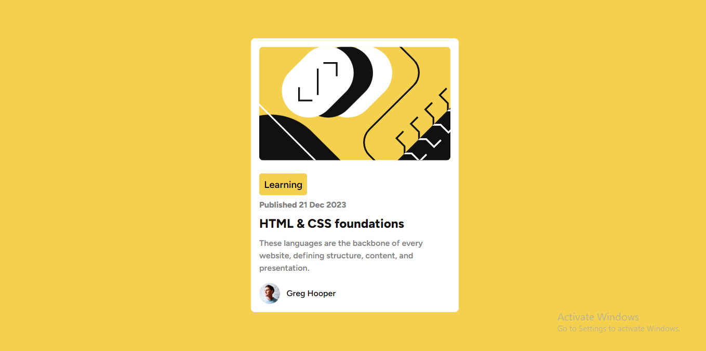

# Frontend Mentor - Blog preview card solution

## Table of contents

- [Overview](#overview)
  - [The challenge](#the-challenge)
  - [Screenshot](#screenshot)
- [My process](#my-process)
  - [Built with](#built-with)
  - [What I learned](#what-i-learned)
  - [Continued development](#continued-development)
- [Author](#author)

## Overview

### The challenge

Users should be able to:

- See hover and focus states for all interactive elements on the page

### Screenshot

## My process

### Built with

- Flexbox
- Semantic HTML5 markup
- CSS custom properties
- Mobile-first workflow

### What I learned

TBH: I did feel comfortable coding this newbie project. Actually, I am starting to think of myself as not a newbie anymore but I still learned something from it because it's been a while since I wrote css.

### Continued development

Animations

## Author

- Website - [George Asiedu](https://www.georgeasiedu.tech)
- Frontend Mentor - [@george5star](https://www.frontendmentor.io/profile/george5star)
- Twitter - [@george5_star](https://www.twitter.com/george5_star)
